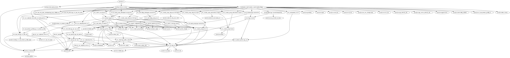

# Infrastructure-As-Code (IAC) Platform 
This is example scenario shows web application running on 3 EC2 instances fronted by an Elastic LoadBalancer (ELB). Each instance is deployed in its own Availability Zone inside the same VPC. The application is simple python webserver serving a static page with some html elements. The purpose is focused on infrastructure as code. If a ec2 instance with the app goes down the application should still be available.


### Prerequisites
Required Tools
```
* [Git](https://git-scm.com/) - SCM
* [Python3](https://python.org/) - Python 3 for Deployment Script
* [Terraform](https://www.terraform.io/) - Write, Plan, and Create Infrastructure as Code
* [AWS](https://aws.amazon.com/) - Cloud Provider for Infrastructure
```


## Getting Started
This terraform will build Infrastructure on AWS using terraform. Make sure to supply 
correct credentials and correct variables in your own `terraform.tfvars` file.

* Note: This Terraform project will create at the most 6 ec2 instances t2.micro, nat-gateway, Subnets, Volumes etc. I am not liable for any charges that may occur on your AWS account

Create a new User in AWS IAM dashboard. Unless you already have User with this access.
* Be sure to add 'Programmatic Access' to the user.

Add permissions to new user for.
* Select 'Attach Existing Policies Directly'
Add these:
    * AmazonEC2FullAccess
    * AmazonRoute53FullAccess
    * AmazonIAMFullAccess

1. Create a KeyPair, ApiKey in AWS.
2. Clone this repo. `git clone https://github.com/mattnidz/IACPlatform.git`
3. `cd IACPlatform`
4. Create `terraform.tfvars` file of your own. This file can be used to override default settings. Fill out similar to this with your credentials.

ami = "ami-011b3ccf1bd6db744"
key_name = ""
region = "us-east-1"
access_key = ""
secret_key = ""


## First Deployment
Initialize the Terraform AWS Provider.

```
terraform init
```

First Plan Terraform IAC (Infrastructure as Code).

```
terraform plan
```

Apply Terraform Infrastructure on AWS. This is the building part!

```
terraform apply
```
You may be prompted for region. You can enter us-east-1.
Also another prompt if you would like to continue. 

Once the terraform completes you should see some output.
```
App Console External URL = http://app-xxxx-console-xxxxx.elb.us-east-1.amazonaws.com:8443
```

### Break down into end to end tests
The App Console External URL should be reliable in the case of one ec2 instance going down.
You can test by stopping an ec2 in the AWS ec2 dashboard. 
If everything works correctly the application located at `http://app-xxxx-console-xxxxx.elb.us-east-1.amazonaws.com:8443` will be loadbalanced and therefore should still reached.


## Upgrades - Next Deployment - Python3 AMI Deployment Script

The Python3 script in this project will change the AMI in the `terraform.tfvars` file for you.
This script is just an example how Automation could be used to automate these deployments in CICD DevOps processes. 

The script will look for `ami-0394fe9914b475c53` in terraform.tfvars and switch it to `ami-0394fe9914b475c53`. 
* Note: Running this will and attempt to run `terraform apply` auto-approve in an automated fashion.
  
Example: 
```
python deploy.py ami-0394fe9914b475c53 ami-011b3ccf1bd6db744
```

Here is the visual dependency graph of Terraform resources according to configuration files.




## Tear Down Infrastructure on AWS

To destroy all resources created.

```
terraform destroy
```


## Built With

* [Git](https://git-scm.com/) - SCM
* [Python3](https://python.org/) - Python 3 for Deployment Script
* [Terraform](https://www.terraform.io/) - Write, Plan, and Create Infrastructure as Code
* [AWS](https://aws.amazon.com/) - Cloud Provider for Infrastructure
* [RedHat](https://www.redhat.com/) - OS of choic for Ec2 instances

## Contributing
#TODO:
Please read [CONTRIBUTING.md] for details on our code of conduct, and the process for submitting pull requests to us.

## Authors

* **Matthew Nidzgorski** - *Initial work* - [Github - Matt Nidzgorski](https://github.com/mattnidz)


## License
see the [LICENSE.md](LICENSE.md) file for details

## Acknowledgments

* Inspired by work done here https://github.com/jkwong888/terraform-icp-aws
* Thanks
